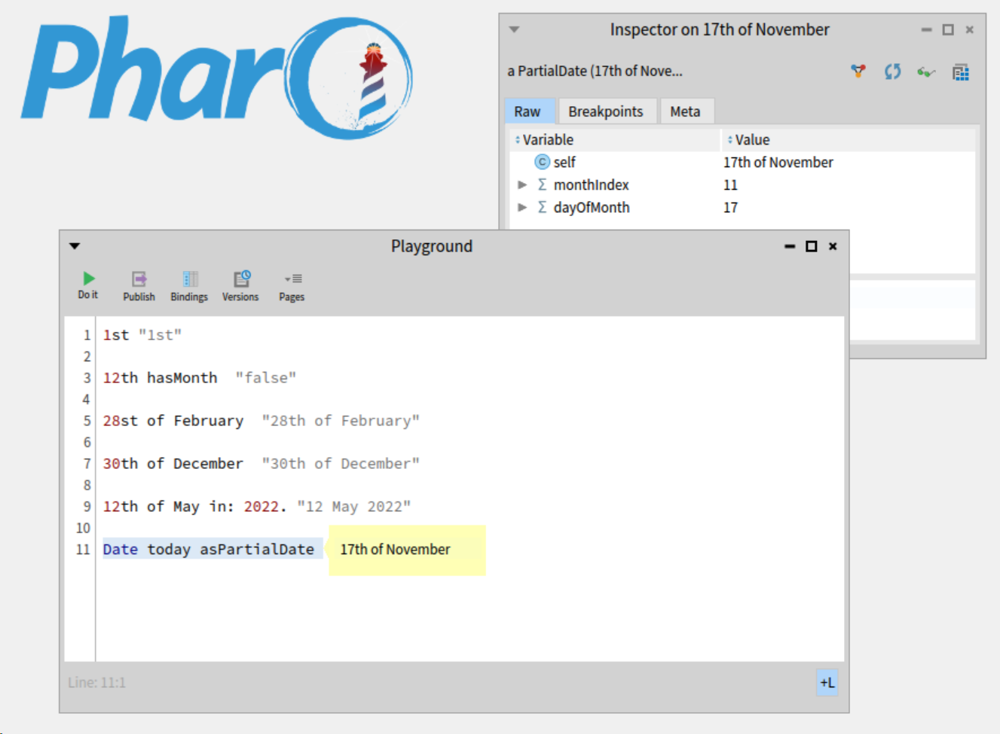

# Pharo-PartialDate
**PartialDate** implementation for [Pharo](http://www.pharo.org) to deal with (yet) incomplete dates

[](https://www.pharo.org) 

[](https://github.com/astares/Pharo-PartialDate/actions?query=workflow%3AUnit%20Tests)
[](https://codecov.io/gh/astares/Pharo-PartialDate/branch/master)

[](LICENSE)
[](https://pharo.org/download)
[](https://pharo.org/download)
[](https://pharo.org/download)
[](https://pharo.org/download)
[](https://pharo.org/download)
[](https://pharo.org/download)

# Quick Start

## Installation via Script
```Smalltalk
Metacello new 
	repository: 'github://astares/Pharo-PartialDate:main/src';
	baseline: 'PartialDate';
	load
```

## Screenshot


# Quick Guide

## Create new instances
To creat a partial date typically you write it in english notion:
```Smalltalk
28th February
```
which will give you an instance of **PartialDate** with 28 as the day and 2 representing February as the month. For a partial date the year is missing.

It is already a partial when you do not even give the month

```Smalltalk
28th 
```

## Convert a partial

You can also convert the partial to a regular **Date** using

```Smalltalk
17th of November in: 2023
```
